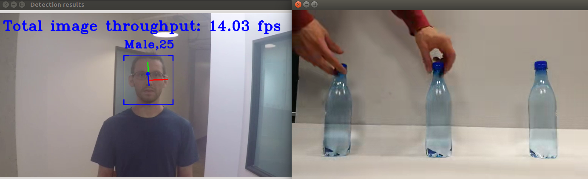
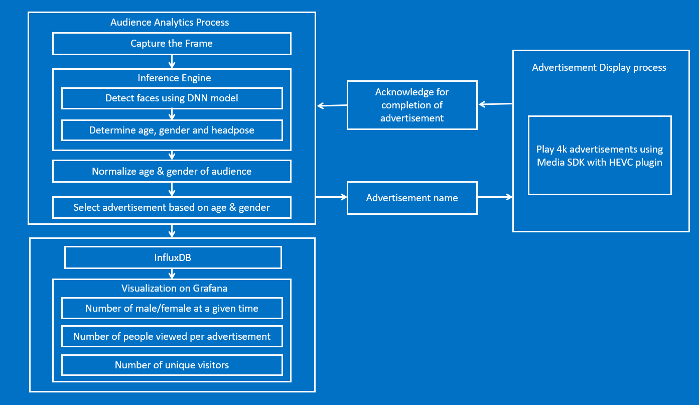
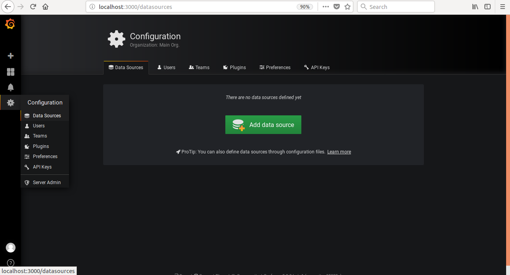
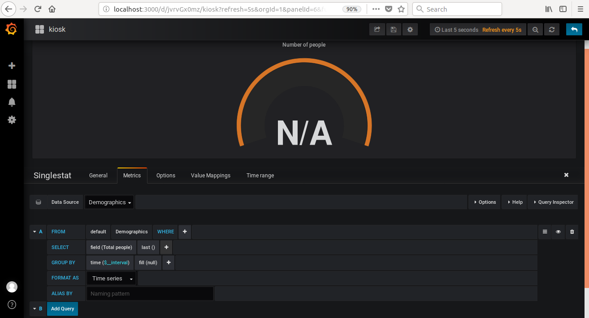
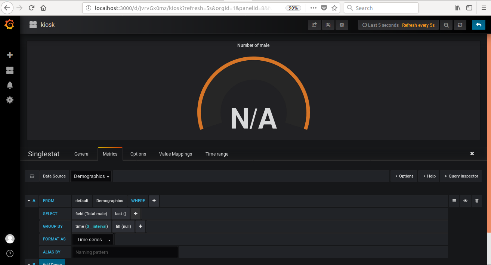
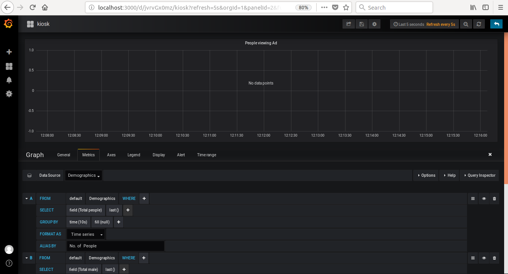
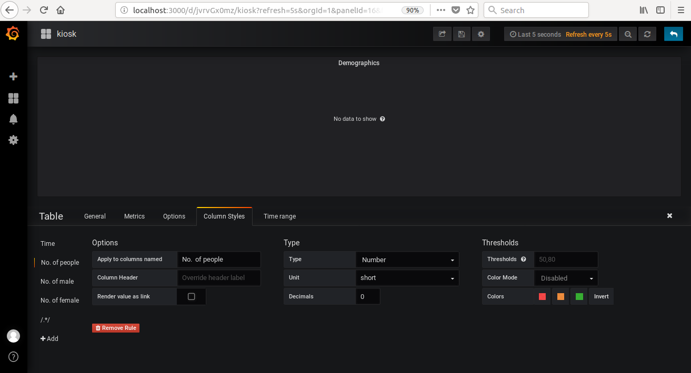
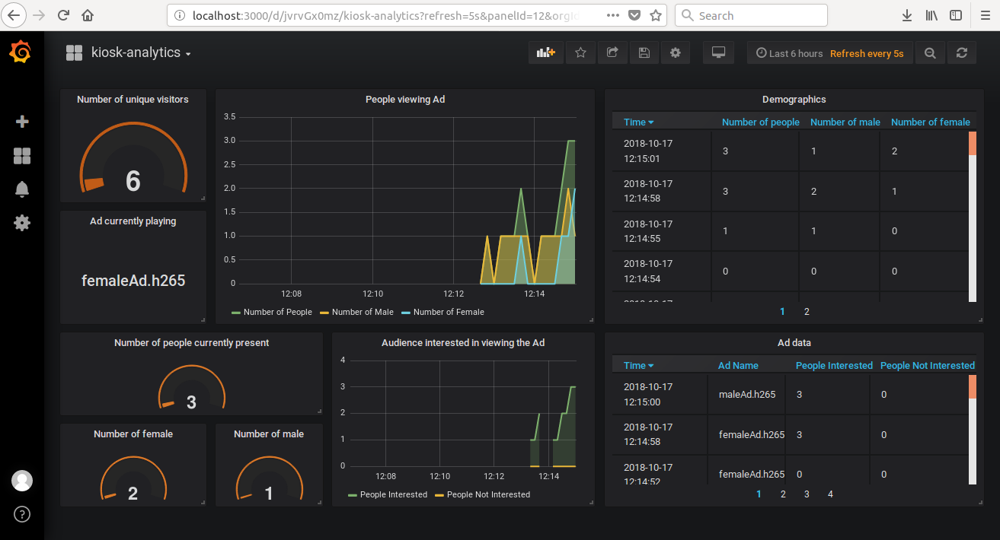

# 4K Advertisement Display on Digital Kiosk Based on Demographics

| Details          |                    |
|-----------------------|---------------|
| Target OS:            |  Ubuntu* 16.04 LTS|
| Programming Language: |  C++ |
| Time to Complete:    |  45 min     |

<br>


<br>

## What it does

This reference implementation is developed using the Intel® Distribution of OpenVINO™ toolkit for audience analytics and Intel® Media SDK for the display of 4K advertisements. The application identifies the age and gender of the audience standing in front of digital signage, and based on the identification, it selects a suitable 4K advertisement. Real-time data visualization,  which enables developers to monitor trends over time, occurs on Grafana*. This reference implementation aims to improve real-world marketing and advertising.

## Requirements

### Hardware

* [IEI Tank* AIoT Developer Kit](https://software.intel.com/en-us/iot/hardware/iei-tank-dev-kit)

### Software
* Ubuntu* 16.04 LTS
* Intel® Distribution of OpenVINO™ toolkit 2019 R2 release
* Intel® Media SDK

## How It Works

The application uses a video source, such as a camera to grab frames, and Deep Neural Networks (DNNs) to process data. The first network detects faces. The second neural network determines age and gender for each detected face. The third neural network detects the head pose of the person.

The application observes the age, gender, and head pose of the person standing in front of the digital signage camera and collects data for five frames. Data are normalized to avoid any fluctuations in the observation. Based on normalized data, the application selects a gender-appropriate advertisement.

A JSON file provides a list of advertisements for different age and gender groups. This JSON file is parsed, and data present in the file such as age group, gender, and a list of advertisements, are stored in a C++ structure. Once the software determines the dominant age-group and gender from the audience analytics, it selects an ad from JSON data, which is decoded using the HEVC plugin and played using Intel® Media SDK.

This application has two processes, the audience analytics process (AAP) and the advertisement display process (ADP). These processes use pipes for inter-process communication.

The AAP analyzes the audience, selects the appropriate ad, and writes the selected ad to the pipe, which the ADP reads from the other end of the pipe. The ADP reads the file name from the pipe, decodes the video which is in H.265 or hevc format, and renders it. Once the advertisement finishes playing, the ADP sends the acknowledgement of ad completion through the pipe to AAP. On receiving the acknowledgement, AAP selects the next ad based on the audience present at that time and sends it to ADP. The new advertisement plays only when the previous advertisement has completed.

The audience analysis happens even when an ad is playing as the two processes run in parallel. For every 20 frames, the application sends data to the InfluxDB database which is then visualized on Grafana to display the trends over time. Grafana visualizes the number of people who were interested in ads, the number of people not interested in ads, the ad currently playing, and the total number of unique visitors who were in front of the digital signage.
<br>




## Setup
### Get the code
Clone the reference implementation
```
sudo apt-get update && sudo apt-get install git
git clone https://github.com/intel-iot-devkit/intelligent-kiosk-analytics-cpp.git
```

### Install OpenVINO
Refer to [Install the Intel® Distribution of OpenVINO™ toolkit for Linux*](https://software.intel.com/en-us/articles/OpenVINO-Install-Linux) for more information about how to install and setup the Intel® Distribution of OpenVINO™ toolkit.

Install the OpenCL™ Runtime Package to run inference on the GPU, as shown in the instructions below. It is not mandatory for CPU inference.

### Other dependencies
**Intel® Media SDK**<br>
Intel® Media SDK provides a plain C API to access hardware-accelerated video decode, encode and filtering on Intel® Gen graphics hardware platforms.

**InfluxDB***<br>
InfluxDB is a time series database designed to handle high write and query loads. InfluxDB is meant to be used as a backing store for any use case involving large amounts of timestamped data, including DevOps monitoring, application metrics, IoT sensor data, and real-time analytics.

**Grafana***<br>
Grafana is an open-source, general purpose dashboard and graph composer, which runs as a web application. It supports Graphite, InfluxDB, Prometheus, OpenTSDB etc., as backends. Grafana allows you to query, visualize, alert on and understand your metrics no matter where they are stored.<br>

### Which models to use
This application uses the **[face-detection-retail-0004](https://docs.openvinotoolkit.org/2019_R2/_intel_models_face_detection_retail_0004_description_face_detection_retail_0004.html)**, **[age-gender-recognition-retail-0013](https://docs.openvinotoolkit.org/2019_R2/_intel_models_age_gender_recognition_retail_0013_description_age_gender_recognition_retail_0013.html)** and **[head-pose-estimation-adas-0001](https://docs.openvinotoolkit.org/2019_R2/_intel_models_head_pose_estimation_adas_0001_description_head_pose_estimation_adas_0001.html)** Intel® models, that can be downloaded using the model downloader. The model downloader downloads the .xml and .bin files that will be used by the application.

To download the models and install the dependencies of the application, run the below command in `intelligent-kiosk-analytics-cpp` directory:<br>
```
./setup.sh
```

### The config file
The _resources/config.json_ contains the path of video that will be used by the application as input.

For example:
   ```
   {
       "inputs": [
          {
              "video":"path_to_video/video1.mp4",
          }
       ]
   }
   ```

The `path/to/video` is the path to an input video file.


### Which Input Video to use
The application works with any input video. Sample videos are provided [here](https://github.com/intel-iot-devkit/sample-videos/).

For first-use, we recommend using [face-demographics-walking-and-pause](https://github.com/intel-iot-devkit/sample-videos/blob/master/face-demographics-walking-and-pause.mp4).

For example:
   ```
   {
       "inputs": [
          {
              "video":"sample-videos/face-demographics-walking-and-pause.mp4",
          }
       ]
   }
   ```
If the user wants to use any other video, it can be used by providing the path in the config.json file.

### Using the Camera instead of video
Replace `path/to/video` with the camera ID in the config.json file, where the ID is taken from the video device (the number X in /dev/videoX).

On Ubuntu, to list all available video devices use the following command:

```
ls /dev/video*
```

For example, if the output of above command is __/dev/video0__, then config.json would be:

```
  {
     "inputs": [
        {
           "video":"0"
        }
     ]
  }
```

### Setup the Environment
 
Go to the project directory:

```
cd <path-to-intelligent-kiosk-analytics-cpp>
```

Configure the environment to use the Intel® Distribution of OpenVINO™ toolkit by exporting environment variables:

```
source /opt/intel/openvino/bin/setupvars.sh
```

### Build the Application

To build, go to `intruder-detector-cpp` directory and run the following commands:

```
mkdir -p build && cd build
cmake ..
make
export LD_LIBRARY_PATH=$PWD/ie_cpu_extension:$LD_LIBRARY_PATH
```

## Run the Application
### Run on the CPU
Although the application runs on the CPU by default, this can also be explicitly specified through the _-d CPU_ _-d_hp CPU_ _-d_ag CPU_ as command-line argument:

```
__bin/Release/application -m /opt/intel/openvino/deployment_tools/open_model_zoo/tools/downloader/Retail/object_detection/face/sqnet1.0modif-ssd/0004/dldt/FP32/face-detection-retail-0004.xml -m_ag /opt/intel/openvino/deployment_tools/open_model_zoo/tools/downloader/Retail/object_attributes/age_gender/dldt/FP32/age-gender-recognition-retail-0013.xml -m_hp /opt/intel/openvino/deployment_tools/open_model_zoo/tools/downloader/Transportation/object_attributes/headpose/vanilla_cnn/dldt/FP32/head-pose-estimation-adas-0001.xml
```

In addition to the model provided by the Intel® Distribution of OpenVINO™ toolkit, the user can include models trained on Caffe*, TensorFlow*, or Apache MXNet* machine learning frameworks for face-detection, age-gender recognition, or head pose. To do this, first configure the model optimizer for the framework used and then convert the trained model to produce an optimized Intermediate Representation (IR) of the model.

Learn more about the model optimizer in the [Model Optimizer Developer Guide](https://software.intel.com/en-us/articles/OpenVINO-ModelOptimizer)

Once the IR is obtained, run the application:
```
__bin/Release/application -m <path-to-face-detection-IR>/face-detection.xml -m_ag <path-to-age-gender-IR>/age-gender-recognition.xml -m_hp <path-to-head-pose-estimation-IR>/head-pose-estimation.xml
```

**Note:**
1. To exit from the application, click on the **Detection results** window and long press the ESC key. <br>
2. To run the application on sync mode, use `-async 0` as the command-line argument. By default the application runs on Async mode.
3. To run with multiple devices use _-d MULTI:device1,device2_. For example: _-d MULTI:CPU,GPU,MYRIAD_

### Running on different hardware

The application can use different hardware accelerator for different models. The user can specify the target device for each model using the command line argument as below:

    -d <device>: Target device for Face Detection network (CPU, GPU, MYRIAD or HDDL).
    -d_ag <device>: Target device for Age Gender Recognition network (CPU, GPU, MYRIAD or HDDL).
    -d_hp <device>: Target device for Head Pose Estimation network (CPU, GPU, MYRIAD or HDDL).

For example:
To run Face Detection model on CPU and Age Gender Recognition model with FP32 on GPU, Head Pose Estimation model on MYRIAD, use the below command:
```
__bin/Release/application -m /opt/intel/openvino/deployment_tools/open_model_zoo/tools/downloader/Retail/object_detection/face/sqnet1.0modif-ssd/0004/dldt/FP32/face-detection-retail-0004.xml -m_ag /opt/intel/openvino/deployment_tools/open_model_zoo/tools/downloader/Retail/object_attributes/age_gender/dldt/FP32/age-gender-recognition-retail-0013.xml -m_hp /opt/intel/openvino/deployment_tools/open_model_zoo/tools/downloader/Transportation/object_attributes/headpose/vanilla_cnn/dldt/FP16/head-pose-estimation-adas-0001.xml -d CPU -d_ag GPU -d_hp MYRIAD
```

**FP32**: FP32 is single-precision floating-point arithmetic uses 32 bits to represent numbers. 8 bits for the magnitude and 23 bits for the precision. For more information, [click here](https://en.wikipedia.org/wiki/Single-precision_floating-point_format) <br>
**FP16**: FP16 is half-precision floating-point arithmetic uses 16 bits. 5 bits for the magnitude and 10 bits for the precision. For more information, [click here](https://en.wikipedia.org/wiki/Half-precision_floating-point_format) <br>

**Note:** The Intel® Neural Compute Stick and HDDL can only run FP16 models. The model that is passed to the application, through the command-line argument, must be of data type FP16 <br>

<!--
### Run on the FPGA

Before running the application on the FPGA, program the AOCX (bitstream) file.<br>
Use the setup_env.sh script from [fpga_support_files.tgz](http://registrationcenter-download.intel.com/akdlm/irc_nas/12954/fpga_support_files.tgz) to set the environment variables.<br>


```
source /home/<user>/Downloads/fpga_support_files/setup_env.sh
```

The bitstreams for HDDL-F can be found under the `/opt/intel/openvino/bitstreams/a10_vision_design_bitstreams` folder. To program the bitstream use the following command:<br>


```
aocl program acl0 /opt/intel/openvino/bitstreams/a10_vision_design_bitstreams/2019R1_PL1_FP11_MobileNet_Clamp.aocx
```

For more information on programming the bitstreams, please refer https://software.intel.com/en-us/articles/OpenVINO-Install-Linux-FPGA#inpage-nav-11

To run the application on the FPGA , use the `-d HETERO:FPGA,CPU` command-line argument:
```
__bin/Release/kiosk -m /opt/intel/openvino/deployment_tools/open_model_zoo/tools/downloader/Retail/object_detection/face/sqnet1.0modif-ssd/0004/dldt/FP32/face-detection-retail-0004.xml -m_ag /opt/intel/openvino/deployment_tools/open_model_zoo/tools/downloader/Retail/object_attributes/age_gender/dldt/FP32/age-gender-recognition-retail-0013.xml -m_hp /opt/intel/openvino/deployment_tools/open_model_zoo/tools/downloader/Transportation/object_attributes/headpose/vanilla_cnn/dldt/FP32/head-pose-estimation-adas-0001.xml -d HETERO:FPGA,CPU
```
-->
### Troubleshooting

The application may display an error concerning regarding shared library loading: *__bin/Release/application: error while loading shared libraries: libcpu_extension.so: cannot open shared object file: No such file or directory*.

If this error occurs, go to *intelligent-kiosk-analytics-cpp* directory and export the environment LD_LIBRARY_PATH variable:
```
cd build
export LD_LIBRARY_PATH=$PWD/ie_cpu_extension:$LD_LIBRARY_PATH
```

### Add New Advertisements to the List of Ads

To add the new ads in JSON file, follow this series of instructions:

1. Video is first converted to H.265 or hevc format using FFmpeg* as the decoding process takes the input videos in this format for decoding. To convert an MP4 video to required format, follow these steps:
    * Install FFmpeg:
    ```
    sudo apt install ffmpeg
    ```

    * Convert video from .mp4 to .hevc format using FFmpeg:
    ```
    ffmpeg -i <input_video>.mp4 -c:v libx265 -c:a aac -b:a 128k <output_video>.hevc
    ```
	
2. Copy the video to the **resources** directory found in the *intelligent-kiosk-analytics-cpp* directory.
3. Add a video file name for an ad. For example, to add a new ad file called  *intel.hevc*, which is meant to be played for males between the age group 28 to 50 years, modify the adlist.json file:
    * Open **adList.json** from `intelligent-kiosk-analytics-cpp/resources` directory in an editor.
    * Add the file name *intel.hevc* at the end of the list of the ads for "Age_Group": 3, "Gender": "M".
    
    ```
        {
            "Age_Group": 3,
            "Gender": "M",
            "Ads": [
                "maleAd.h265",
                "maleAd.h265",
                "maleAd.h265",
                "intel.hevc"
            ]
        }
    ```

    **Note**:
    * There are four age groups considered in the application:
        * Child: 1 to 13 yrs belongs to age group 1
        * Young Adult: 14 to 28 yrs belongs to age group 2
        * Adult: 28 to 50 yrs belongs to age group 3
        * Senior: 50+ yrs belongs to age group 4


### InfluxDB Database

* Check time series demographics data on InfluxDB databases:
 
    ```
    influx
    show databases
    use Demographics
    select * from Demographics
    ```

### Visualize on Grafana
* To visualize data on Grafana:

  * On the terminal, start the Grafana server:
    
      ```
      sudo service grafana-server start
      ```

  * Open the browser and go to **localhost:3000**.

  * Sign in with user as **admin** and password as **admin**.

  * Select the **Configuration** icon and then choose **Data Sources**.

       

  * Select **+ Add data source** and add these settings:
     * *Name*: Demographics
     * *Type*: InfluxDB
     * *URL*: http://localhost:8086
     * *Database*: Demographics
     * Click on “Save and Test”

   * Click the **Back** button at the bottom of the page. Select **+ Add data source** and enter these settings:
     * *Name*: AdData
     * *Type*: InfluxDB
     * *URL*: http://localhost:8086
     * *Database*: AdData
     * Click on “Save and Test”

    * Click the **Back** button at the bottom of the page. AdData and Demographics are added to the data sources.

       

  * To create a new dashboard:

     1. Select **+** icon from the side menu bar which is under Grafana icon and select **Dashboard**.  

        

     2. Select **Singlestat**. Click on the **Panel Title** and select **Edit**. 
        * Click on **General** in Singlestat menu tab and change the Panel Title to *Number of people*.
        * Click on **Metrics** in Singlestat menu tab. From **Data Source** choose **Demographics**. 
        * Click on **Add Query**. Click on **select measurement** and select **Demographics**.  
        * In **field (value)** click on **value** and select **Total people**.
        * Click on **+** beside *mean* in **SELECT** field. From **Selectors**, select **last()**. It will override *mean()*.
        
            After the series of steps #2., query A will be: 
               
              FROM default Demographics SELECT field(Total people) last() GROUP BY time($__interval) fill(null) FORMAT AS Time Series

        

        * Click on **Options** in Singlestat menu tab. Select **Current** from **stat** field and change the **Font size** to *120*, in the first row.
        * Select **show** under **Gauge** option present at the bottom.
        * Save the dashboard with name **Kiosk**. Save button is provided in the top menu.

        
    
     3. Repeat step 2 to add *Singlestat panel* for *Number of male* to the dashboard, with these modifications:
        * For the panel title, change *Number of people* to *Number of male*.
        * Select **Total male** in the **field (value)** of **Metrics**  Singlestat menu option.

            Query A will be: 

              FROM default Demographics SELECT field(Total male) last() GROUP BY time($__interval) fill(null) FORMAT AS Time Series

        
        
        * Save the dashboard and click on the **Back to dashboard** icon on right corner of the top menu.

     4. Similarly, to add *Singlestat panel* for *Number of female* to the dashboard, repeat step 2 with these modifications:
        * For the panel title, change *Number of people* to *Number of female*.
        * Select **Total female** in the **field (value)** of **Metrics**  Singlestat menu option.

            Query A will be: 

              FROM default Demographics SELECT field(Total female) last() GROUP BY time($__interval) fill(null) FORMAT AS Time Series
        
        * Save the dashboard and click on the **Back to dashboard** icon.

     5. Add a graph for visualizing demographics time series data:
        * Click on the **add panel** icon on the top menu and click on **Graph**. This will add the Graph to the dashboard.
        * Click on the **Panel Title** of the Graph and select **Edit**. 
        * Click on **General** in Graph menu tab and change the Panel Title to *People viewing Ad*.
        * Click on **Metrics** in Graph menu tab. From **Data Source** choose **Demographics**. 
        * Click on **Add Query**. Click on **select measurement** and select **Demographics**. 
        * Click on **field (value)** and select **Total people**. 
        * Click on **+** in **SELECT** field. From **Selectors**, select **last()**.
        * In GROUP BY field, click on **time($__interval)** and select **10s**. 
        * Name the query as **Number of people** in the **ALIAS BY** row.

          Query A will be: 
               
              FROM default Demographics SELECT field(Total people) last() GROUP BY time(10s) fill(null) FORMAT AS Time Series ALIAS BY Number of People

        * Similarly add queries for displaying no. of male and female by clicking on **+**. For male and female, queries will be:

          Query B: 
               
              FROM default Demographics SELECT field(Total male) last() GROUP BY time(10s) fill(null) FORMAT AS Time Series ALIAS BY Number of male

          Query C: 
               
              FROM default Demographics SELECT field(Total female) last() GROUP BY time(10s) fill(null) FORMAT AS Time Series ALIAS BY Number of female

        

        * Click on **Display** in Graph menu tab and change the values of **Fill** and **Line Width** under **Mode Options** to **2**.
        * Click on **Time Range** present on the menu tab and write **500s** in the text box provided beside **Override relative time** **Last**.   
        * Save the dashboard and click on **Back to dashboard** icon.

     6. Add the table for displaying the Demographics data:
         * Click on the **add panel** icon on the top menu and click on **Table**.
         * Click on the **Panel Title** of the Table and select **Edit**. 
         * Click on **General** in Table menu tab and change the Panel Title to *Demographics*.
         * Click on **Metrics** in Table menu tab. From **Data Source** choose **Demographics**.  
         * Configure the following queries under **Metrics**:
          
           Query A: 
              
               FROM default Demographics SELECT field(Total people) last() GROUP BY time(1s) fill(none) FORMAT AS Time Series ALIAS BY Number of People
          
           Query B:

               FROM default Demographics SELECT field(Total male) last() GROUP BY time(1s) fill(none) FORMAT AS Time Series  ALIAS BY Number of male
            
           Query C:

               FROM default Demographics SELECT field(Total female) last() GROUP BY time(1s) fill(none) FORMAT AS Time Series ALIAS BY Number of female

         * From the **Column Styles** on the menu tab, click on **+Add** and in the **Apply to columns named** give the name as **No. of people** and under *Type*, select **Number** in **Type** and write **0** in the **Decimals** field as shown in the image below.

        

         * Similarly in **Column Styles** add the rules for *No. of male* and *No. of female* and select **Number** in **Type** and write **0** in the **Decimals** field.
         * Save the dashboard and click on **Back to dashboard** icon.
        
     7. Add the graph for displaying the people interested in viewing the ad:
         * Click on the **add panel** icon on the top menu and click on **Graph**. This will add the Graph to the dashboard.
         * Click on the **Panel Title** of the Graph and select **Edit**. 
         * Click on **General** in menu tab and change the Panel Title to *Audience interested in viewing the Ad*. 
         * Click on **Metrics** in Graph menu tab. From **Data Source** choose **AdData**.
         * Configure the following queries under **Metrics**:

            Query A:

                FROM default AdData SELECT field(peopleInterested) last() GROUP BY time(10s) fill(null) FORMAT AS Time Series ALIAS BY People Interested

            Query B:

                FROM default AdData SELECT field(peopleNotInterested) last() GROUP BY time(10s) fill(null) FORMAT AS Time Series ALIAS BY People Not Interested

         * Click on **Display** in Graph menu tab and change the values of **Fill** and **Line Width** under **Mode Options** to **2**. 
         * Click on **Time Range** present on the menu tab and write **500s** in the text box provided beside **Override relative time** **Last**.   
         * Save the dashboard and click on **Back to dashboard** icon.        
      
     8. Add the table for displaying the people interested in viewing the ad:
         * Click on the **add panel** icon on the top menu and click on **Table**.
         * Click on the **Panel Title** of the Table and select **Edit**. 
         * Click on **General** in Table menu tab and change the Panel Title to *Ad Data*.
         * Click on **Metrics** in Table menu tab. From **Data Source** choose **AdData**.  
         * Configure the following queries under **Metrics**:

            Query A:

                FROM default AdData SELECT field(previousAd) last() GROUP BY time(1s) fill(none) FORMAT AS Time Series ALIAS BY Ad name           

            Query B:

                FROM default AdData SELECT field(peopleInterested) last() GROUP BY time(1s) fill(none) FORMAT AS Time Series ALIAS BY People Interested

            Query C:

                FROM default AdData SELECT field(peopleNotInterested) last() GROUP BY time(1s) fill(none) FORMAT AS Time Series ALIAS BY People Not Interested      

          * In **Column Styles** add the rules for *People interested* and *People not interested* and select **Number** in **Type** and write **0** in the **Decimals** field.   
          * Save the dashboard and click on **Back to dashboard** icon.

     9. Display the ad currently playing on the dashboard:
          * Select **Singlestat**, Click on the **Panel Title** and select **Edit**.
          * Click on **General** in Singlestat menu tab and change the Panel Title to *Ad currently playing*.
          * Click on **Metrics** in Singlestat menu tab. From **Data Source** choose **AdData**. 
          * Configure the following queries under **Metrics**:

            Query A:

                FROM default AdData SELECT field(currentAd) last() GROUP BY time($__interval) fill(null) FORMAT AS Time Series

          * Save the dashboard and click on **Back to dashboard** icon. 

     10. To add *Singlestat panel* for *Number of unique visitors* to the dashboard, repeat step 2 with this modifications:
          * Instead of *Number of people*, set the panel title to *Number of unique visitors*.
          * Select **Unique visitors** in the **field (value)** of **Metrics**  Singlestat menu option.

            Query A in this case will be: 

              FROM default Demographics SELECT field((Unique visitors)) last() GROUP BY time(1m) fill(null) FORMAT AS Time Series

          * Click on **Options** in Singlestat menu tab. Select **Current** from **stat** field under *Value* and change the **Font size** to *120*, in the first row.        
          * Save the dashboard and click on **Back to dashboard** icon.

     11.  Select **Time picker** from the top menu of dashboard. Under **Custom range** change the **From** value to **now-10m** , **To** to **now** and **Refreshing every:** to **5s**, click on **Apply** and save the dashboard.

       

  * Run the C++ code to visualize data on grafana.

  * Panels can be arranged on the dashboard by resizing and dragging. 

       
       

    ####  Alternatively, visualization on Grafana can be done by following these steps:

    1. In your browser, go to localhost:3000.
    2. Log in with user as **admin** and password as **admin**.
    3. Click on **Configuration**.
    4. Select **“Data Sources”**.
    5. Click on **“+ Add data source”** and provide these settings: 
        * *Name*: Demographics
        * *Type*: InfluxDB
        * *URL*: http://localhost:8086
        * *Database*: Demographics
        * Click on “Save and Test”

        Click on **Back** button at the bottom of the page. Click on **“+ Add data source”** and provide these settings:
        * *Name*: AdData
        * *Type*: InfluxDB
        * *URL*: http://localhost:8086
        * *Database*: AdData
        * Click on “Save and Test”

    6. Click on **+**  icon present on the left side of the browser, select **import**.
    7. Click on **Upload.json File**.
    8. Select the file name "kiosk-analytics.json" from intelligent-kiosk-analytics-cpp/resources directory.
    9. Select "Demographics" in **Select a influxDB data source** beside *Demographics* and "AdData" data source in **AdData** field.
   10. Click on import.  
   11. Run the application to see the data on Grafana.
